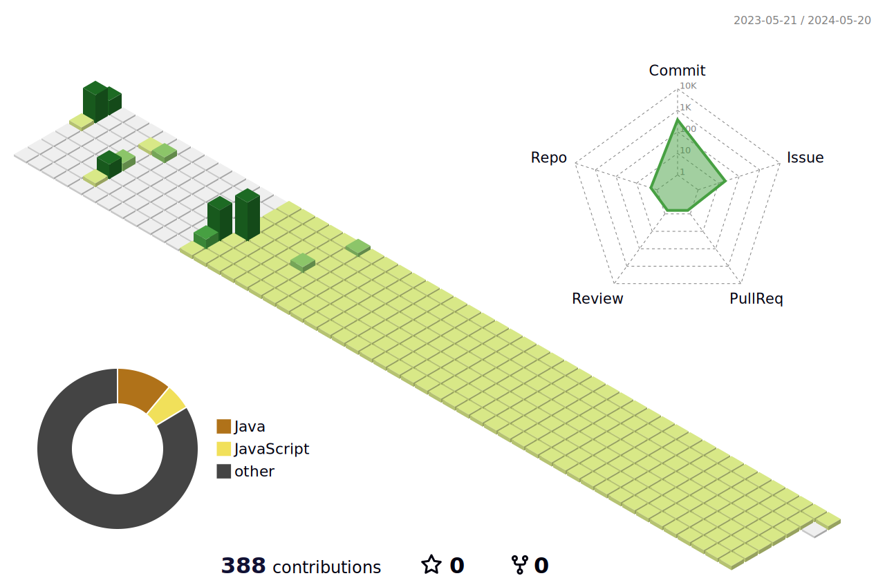

		

<strong>팀플레이어 개발자</strong> 김애리 입니다.

	

  
<b>:mag: 자기소개</b>

  

      
  중국에서의 대학 생활과 탁구 선수로서의 경험을 통해 다양한 배경과 문화를 가진 사람들과의 협력 능력을 키우고 원활한 소통을 할 수 있는 능력을 키웠습니다. 이러한 경험은 제가 비트캠프에서의 6개월 동안 백엔드 개발자로서의 교육을 받는 데 큰 도움이 되었습니다.

비트캠프에서의 교육 기간 동안, 4개월 간의 강의와 2개월 간의 프로젝트를 통해 저는 출석률 100%를 유지하며 끈기 있게 노력했습니다. 이러한 노력을 통해 백엔드 개발 분야의 기술과 지식을 체계적으로 습득하고 활용할 수 있는 능력을 기르게 되었습니다.

비트캠프 교육을 통해 얻은 첫 번째 교훈은 IT 분야에서의 팀플레이어 역량의 중요성입니다. 이는 중국 대학 생활에서의 협력 경험과도 일맥상통하며, 효과적인 협업을 통해 더 나은 결과물을 도출할 수 있음을 깨달았습니다.

두 번째로, 개발 능력뿐만 아니라 그것을 명확하고 체계적으로 전달할 수 있는 문서 작성의 중요성을 깨달았습니다. 이는 제가 중국에서 탁구 선수로서 경기 결과를 분석하고 팀원들과 전략을 공유하는 과정에서도 중요한 역할을 해왔던 습관과 부합합니다.

원래 스포츠데이터 분야에 관심을 갖고 있었으나, 데이터 분석만으로는 기술적인 깊이와 폭을 충족시키기 어려움을 느꼈습니다. 이로 인해 백엔드 개발로의 전향을 결정하게 되었고, 데이터 처리와 관리 능력을 향상시키며 끊임없는 성장을 추구하고자 합니다.

비트캠프 교육을 통해 얻은 교훈은 코드가 공통의 목표를 향해 다양한 방향으로 나아갈 수 있다는 것입니다. 이러한 경험을 토대로, 목적을 향해 다양한 전략을 모색하며 이끌어 나갈 수 있는 팀플레이어로서의 개발자로 성장하였다고 자부합니다. 저의 능력을 바탕으로 회사의 성장과 발전에 기여하고 싶습니다.

  

	<h3>:link: 링크</h3>
	📚 <a href="https://bit.ly/45umUom">김애리 포트폴리오</a>  
	📚 <a href="https://bit.ly/45umUom">김애리 자소서</a>
	
	<h3>📚 Tech Stack 📚</h3>
	
✨ Platforms & Languages ✨

	
	
	
	
	
	 
	
	
	
	
	 
	
	
	
	

 

	
🛠 Toolsk 🛠

	
	
	 
	
	
	
	
	

 

	
🎨 SNS & Portfolio 🎨

	
	
	
	
	 

